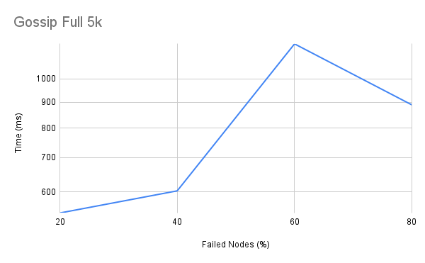
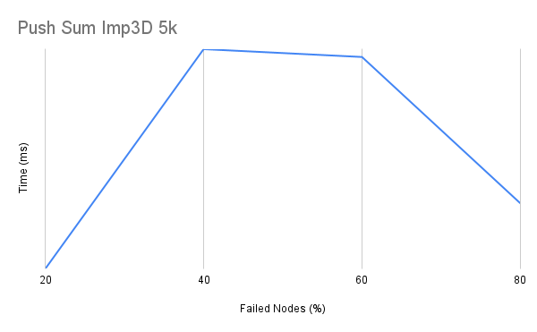
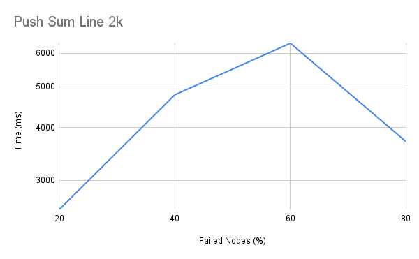

<h1  align="center">Bonus with Failed Nodes for Gossip and Push Sum Algorithm</h1>


## Table of Contents

- [Table of Contents](#table-of-contents)

- [How to run?](#how-to-run)

- [Description](#description)

- [Conclusion](#conclusion)

## How to run?

- Download the repository `git clone git@github.com:npsedhain/gossip-push-sum.git`

- Change directory to `gossip-push-sum/bonus` locally and run `ponyc`

- You should see a binary file being created in the directory with the directory name: `bonus`, then you can run `./bonus numberOfNodes network algorithm`
	- where `numberOfNodes` is the total number of participants you want in the distributed systems;
	- `network` is the type of network you want to test in -
		- can be `line` or `full` or `3D` or `imp3D`
	- `algorithm` is the communication protocol you want to test in -
		- can be `gossip` or `pushsum`


## Description

For the bonus point in the project, we were supposed to introduce a failure-tolerant mechanism where the failed nodes will be handled and the network will still be converged. Since it is a simulation, we introduced a small change in our code which was already almost fault-tolerant.

We created a getFailedNodes function which randomly selects failed node indexes out of the provided total. We update the total failed nodes manually in the code observe the behavior.

```
fun ref getFailedNodes(total: I64) =>
  for i in Range[I64](0, total) do
    let index: I64 = (@rand().abs().usize() % totalNodes.usize()).i64()
    _failed_nodes.set(index)
  end
```

In concept, there is little difference between converged nodes and failed nodes as both of these do not participate in the communication. Hence, if the node is failed, we assume it has already converged and it no longer takes part in the communication protocol.

We found that doing this, the intuitive response was the reduction of convergence time - which is exactly what we found out.

Below are the findings for some of the algorithm-network combination and what happened when the number of failed nodes were increased.

### Gossip-Full-5k



### Gossip-3D-5k


### Push-Sum-Line-2k



### Push-Sum-imp3D-5k




## Conclusion

As we can see that in all the graphs the time taken to converge maxes when the failure rate is about 50% and then on the either side the time is reduced. This makes sense as when there is less failure, the nodes converge faster and when there are less amount of nodes- it converges faster too. But when there are a lot of failed nodes in between, it takes a bit more time to find the appropriate node that is not converged.
