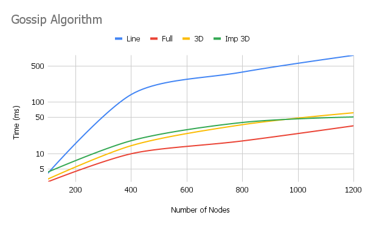

<h1  align="center">Gossip and Push Sum Algorithm</h1>

## Table of Contents

- [Table of Contents](#table-of-contents)

- [Group members](#group-members)

- [How to run?](#how-to-run)

- [What is working?](#what-is-working)

  - [Topologies](#topologies)
    - [Line Topology](#line-topology)
    - [Full Topology](#full-topology)
    - [3D and Imperfect 3D Topology](#3d-and-imperfect-3d-topology)

	- [Gossip](#gossip)
		- [Logarithmic Scale](#gossip)
	- [Push Sum](#push-sum)
		- [Logarithmic Scale](#push-sum)

- [Largest Network](#largest-network)
  - [Gossip 12k](#gossip-12k)
	  - [Logarithmic Scale](#gossip-12k)

  - [Push Sum 10k](#push-sum-10k)
	  - [Logarithmic Scale](#push-sum-10k)

- [Interesting findings](#interesting-findings)

## Group members

- Dinank Bista (UF ID - 41975568)
- Anup Sedhain (UF ID - 92896347)

## How to run?

- Download the repository `git clone git@github.com:npsedhain/gossip-push-sum.git`

- Change directory to `gossip-push-sum` locally and run `ponyc`

- You should see a binary file being created in the directory with the directory name: `gossip-push-sum`, then you can run `./gossip-push-sum numberOfNodes network algorithm`
	- where `numberOfNodes` is the total number of participants you want in the distributed systems;
	- `network` is the type of network you want to test in -
		- can be `line` or `full` or `3D` or `imp3D`
	- `algorithm` is the communication protocol you want to test in -
		- can be `gossip` or `pushsum`

## What is working?

All of the provided network topologies work as expected in any of the provided communication protocols.

### Topologies

#### Line Topology

In <b>Line topology</b>, each node is connected to at most two peers on both sides, with end nodes connected to only one neighbor. This limited connectivity makes it the slowest network for information propagation, resulting in the longest convergence time.

#### Full Topology

In <b>Full topology</b>, each node is interconnected to all others in the network. This complete connectivity allows for rapid information exchange, making it the fastest to converge. The full topology consistently shows the shortest convergence time across different network sizes.

#### 3D and Imperfect 3D Topology

In <b>3D and imperfect 3D topologies</b>, each node is connected to at most 6 and 7 nodes respectively. These topologies perform better than the line topology but not as well as the full topology. In our implementation, we found these networks to converge significantly faster than the line topology, with the imperfect 3D topology slightly outperforming the regular 3D topology due to the extra connection per node.

### Gossip

The gossip algorithm is a decentralized communication protocol where nodes periodically exchange information with randomly selected peers, allowing data to spread through a network like a rumor, hence the name "Gossip".

To know that all the peers reach a consistent state, we define convergence criteria. In this case, we say a system has reached convergence when each node in the system has received the information at least 10 times. Once a node reaches convergence, it doesn't transmit information to its peers.

<b>The time taken for all the nodes to reach convergence is the convergence time.</b>

Here, we visualize how convergence time differs in the different network topologies.

#### Logarithmic Scale Gossip

### Push Sum

The push-sum algorithm is a decentralized protocol for computing the average of values across a network. In this algorithm, each node maintains two values: a sum and a weight. Nodes periodically send half of their sum and weight to randomly selected neighbors, allowing the network to converge to the global average.

To determine when the system has reached a consistent state, we define convergence criteria. In this case, we say a system has reached convergence when the difference between a node's current estimate and its previous estimate is less than a small delta (10^-10) for three consecutive rounds.

<b>The time taken for all the nodes to reach this convergence state is the convergence time.</b>

Here, we visualize how convergence time differs in the different network topologies for the push-sum algorithm:

#### Logarithmic Scale Push Sum

## Largest Network

The largest network that we have managed to solve is 12k nodes for gossip algorithm in all topology and 10k nodes for push sum algorithm (except for line topology).

The following are the result of running the topologies in different combinations.

### Gossip 12k

#### Log Scale Gossip 12k

### Push Sum 10k

#### Log Scale Push Sum 10k

## Interesting findings

- All nodes weren't converging even during the trial period and the program would just halt. We found out that this was due to the fact that if one of the nodes converged, the chain was broken there. This was mostly noticed in line topology. So, to mitigate this, we choose any of the random neighbors to send gossip in case the node is converged. This makes sure all nodes converge in any topology.

- For the gossip algorithm, the most interesting finding was the fact that full topology didn't do as well as we expected in the network with higher number of nodes.
	- Concept of **fanout**: We found out that to get the most out of full topology, we need to send gossip from one node to around 1-5% of total nodes. This would ensure the optimal performance in full topology. However, we wanted to compare the topologies in the same conditions, so we chose to not do that in this project. But we now know that with **fanout** implementation, full topology will be the best.
	- 3D topology performed well in our case as it had the best ratio of neighbors and the gossip sent making the topology to converge the fastest.

- Line topology had the worst performance in all cases especially when it came to computation involved in push sum algorithm.

- For the push sum algorithm, when the number of nodes were increased, line topology couldn't perform well. We had to stop the number of nodes for line at 7k which took a significant amount of time. For the rest, we were able to reach to 10k nodes. Interesting finding here was that imp3D and full topology performed almost similarly. Again we believe, usage of the **fanout** concept will make full topology perform better.

- In all the cases, we also found out that the convergence criteria is directly proportional to the convergence time. That is reducing the order of convergence reduces time taken as well and vice-versa.
